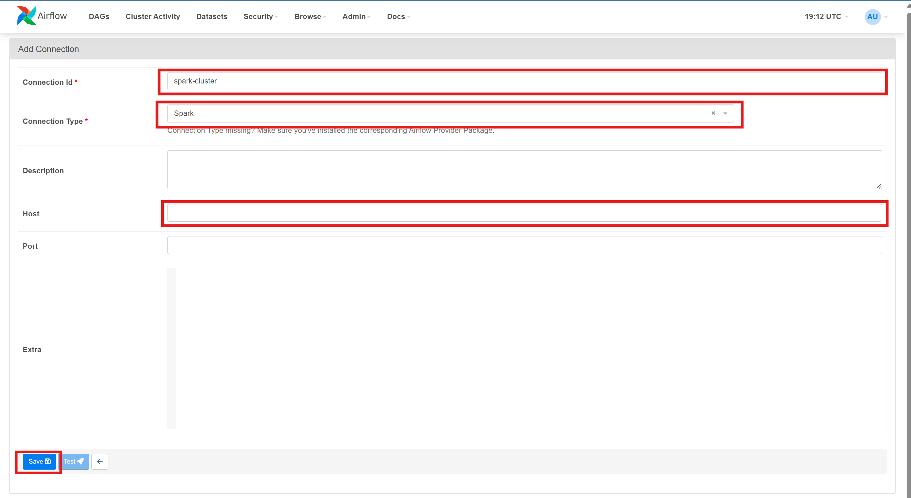

# **Spark Airflow with Apache Iceberg & Nessie**

This project integrates **Apache Spark**, **Airflow**, **Apache Iceberg**, and **Project Nessie**, enabling efficient data processing and lakehouse management.

---

## **Prerequisites**
Before running this project in **Docker**, ensure you have the following services set up:

- **Nessie**
- **Portainer**
- **MinIO**
- **Dremio** (optional)

---

## **Installation**

### **Step 1: Clone the Repository**
Clone this repository to your local machine:

```sh
git clone https://github.com/izzaldeen98/spark-airflow
```

---

### **Step 2: Create the `.env` File**

Your `.env` file should contain the following environment variables:

```ini
PORTINAR_USERNAME=<YOUR_USER_NAME>
PORTINAR_PASSWORD=<YOUR_PASSWORD>
PORTINAR_URL=<YOUR_URL>

MINIO_ACCESS_KEY=<YOUR_ACCESS_KEY>
MINIO_SECRET_KEY=<YOUR_SECRET_KEY>
MINIO_URL=<YOUR_URL>

NESSIE_URL=<YOUR_URL>
NESSIE_DATA_WAREHOUSE_PATH=<YOUR_S3A_DATA_WAREHOUSE_PATH>
```

---

### **Step 3: Add Required JAR Files**

Download the following JAR dependencies and place them inside the `/jars` directory:

- [aws-java-sdk-bundle-1.12.426](https://repo1.maven.org/maven2/com/amazonaws/aws-java-sdk-bundle/1.12.426/aws-java-sdk-bundle-1.12.426.jar)
- [hadoop-aws-3.3.2](https://repo1.maven.org/maven2/org/apache/hadoop/hadoop-aws/3.3.2/hadoop-aws-3.3.2.jar)
- [iceberg-spark-runtime-3.3_2.12](https://repo1.maven.org/maven2/org/apache/iceberg/iceberg-spark-runtime-3.3_2.12/1.7.1/iceberg-spark-runtime-3.3_2.12-1.7.1.jar)
- [nessie-spark-extensions-3.3_2.12-0.70.0](https://repo1.maven.org/maven2/org/projectnessie/nessie-integrations/nessie-spark-extensions-3.3_2.12/0.70.0/nessie-spark-extensions-3.3_2.12-0.70.0.jar)

⚠ **Note:** Ensure you install the exact versions specified above to maintain compatibility with the Apache Spark version used in this project.

---

### **Step 4: Start the Services Using Docker Compose**

Run the following command to start all required services:

```sh
docker-compose up -d
```

---
### **Step 5: Create an Airflow admin user**

Run the following command to create an admin user:

`docker exec -it airflow-webserver bash` This will open the airflow bash on your tarminal.
```
airflow users create \
    --username <USERNAME> \
    --password <PASSWORD> \
    --firstname <FIRST_NAME> \
    --lastname <LAST_NAME> \
    --role Admin \
    --email <EMAIL>
```

### **Step 6: Adding a Spark Connection to Airflow**

To configure a Spark connection in Airflow, follow these steps:

1. **Log in to Airflow**, then navigate to `Admin > Connections` and click on the **"+" (Add Connection)** button.

   

2. On the **Create Connection** page:
   - In the **Connection Id** field, enter `spark-cluster`. This is the default connection used in `custom_operators`. If you prefer a different name, make sure to specify it when calling the function.
   - Set **Connection Type** to `Spark`.
   - Provide the **Host** and **Port** details of your Spark cluster.

   

3. Click **Save** to complete the setup.

Once configured, Airflow will be able to communicate with your Spark cluster for executing distributed data processing tasks.


---

## **Project Structure**

```plaintext
spark-airflow
|   .env
|   .gitignore
|   airflow.dockerfile
|   docker-compose.yml
|   README.md
+---config
|   └── spark-defaults.conf
+---dags
|       ├── constants.py
|       ├── custom_operators.py
|       ├── helper.py
|       ├── nba_data_ingest.py
|       ├── nba_prod.py
|       ├── nba_raw.py
|       ├── nba_staging.py
|       └── __init__.py
+---jars
|       ├── aws-java-sdk-bundle-1.12.426.jar
|       ├── hadoop-aws-3.3.2.jar
|       ├── iceberg-spark-runtime-3.3_2.12-1.7.1.jar
|       └── nessie-spark-extensions-3.3_2.12-0.70.0.jar
+---jobs
|       ├── nba_prod_spark_job.py
|       ├── nba_raw_spark_job.py
|       └── nba_staging_spark_job.py
+---logs
|   | ...
+---nba_ingestion
|       ├── Dockerfile
|       ├── kaggle_ingest.py
|       └── requirements.txt
\---postgres_data
    |   ...
```

---

## **Building and Deploying the `nba_ingestion` Docker Image**

You need to build a Docker image for `nba_ingestion` before running it in **Portainer**. Use the following steps:

```sh
cd nba_ingestion
docker build -t nba_ingestion .
```

🚨 **Ensure:**
- The Docker image is named `nba_ingestion` **without a version tag**.
- If you change the image name, update it in the `nba_data_ingest.py` DAG.

---

## **Conclusion**

This project enables a scalable and efficient data processing pipeline leveraging **Apache Spark, Airflow, Iceberg, and Nessie**. By following the setup instructions, you can deploy a fully operational data lakehouse environment with integrated workflow automation.


🚀 **Happy Data Engineering!**
